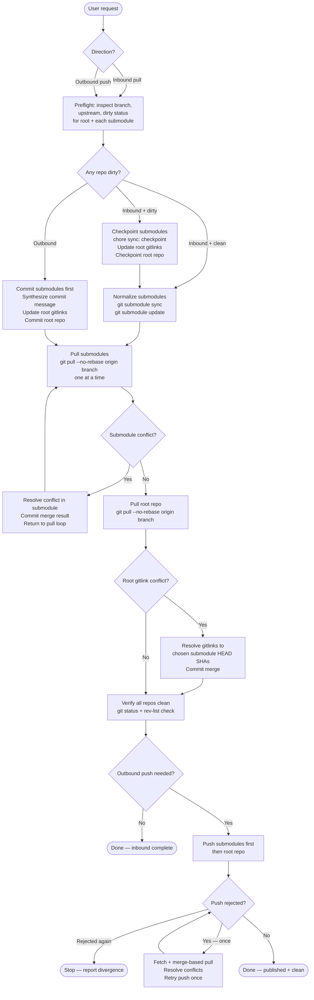

# git-sync
A canonical skill for bidirectional git workspace synchronization across multi-submodule repositories. Covers both the inbound direction (merge-based pulls with dirty-workspace checkpointing, submodule-first ordering, and gitlink conflict resolution) and the outbound direction (commit then push in submodule-first order with mandatory pre-push inbound reconciliation).

## Install

The fastest cross-agent install path is the `skills` CLI:

```bash
npx skills add gg-skills/git-sync
```

Drop this skill into a workspace as a Git submodule for pinned versions, or as a plain clone for latest `main`:

```bash
# Project-local, version-pinned:
git submodule add git@github.com:gg-skills/git-sync.git .claude/skills/git-sync

# OR project-local, latest main:
mkdir -p .claude/skills
git -C .claude/skills clone git@github.com:gg-skills/git-sync.git

# OR user-level, available in every project on this machine:
mkdir -p ~/.claude/skills
git -C ~/.claude/skills clone git@github.com:gg-skills/git-sync.git
```

Restart your agent or reload skills after installation. See the parent [`skills` catalog repo](https://github.com/gg-skills/skills) for the full catalog.

## When to use

**Inbound (pull from origin):**

- The user asks to pull, update, or sync the working tree from `origin`.
- The working tree is dirty and the user wants work preserved before pulling.
- Submodule gitlinks need reattachment after a merge or conflict resolution.
- A prior pull left submodules in a detached or inconsistent state.

**Outbound (push to origin):**

- The user asks to commit and push changes from the current working tree.
- `git status` shows dirty files in the root repo or configured submodules and the goal is to push to origin.
- The user wants to publish without manually sequencing root and submodule commits.

**Skip when:**

- The goal is only to push local changes but the request was phrased as a pull (use Inbound instead).
- The goal is only to refresh without creating publish commits (use Inbound instead).
- Only a single submodule needs updating without root-repo coordination.

## How it operates

### Inputs

**Working tree state** — the root repo and every configured submodule declared in `.gitmodules` are the implicit inputs. The skill inspects each repo's branch, upstream tracking ref, and dirty/clean status before taking any action.

**`.gitmodules`** — determines the set of configured submodules and their branch configuration. Read-only during diagnostic phases.

**Explicit direction flag** — inbound (pull) or outbound (push); always resolved from the user's request before any git command runs.

**Optional commit message** — for outbound publish commits. If not supplied, a concise conventional commit message is synthesized per repo, not squashed across the whole workspace.

### Outputs

**Inbound:** a clean working tree with every repo attached to its intended branch and at upstream parity. Root gitlinks point to the submodule SHAs chosen after merge resolution.

**Outbound:** published commits in every dirty configured submodule and the root repo, pushed to `origin` in submodule-first order. Root repo records the published submodule `HEAD` SHAs. Final state: every repo clean, not ahead of or behind upstream.

**Checkpoint commits** (inbound, when dirty) — `chore(sync): checkpoint before pulling origin` commits in dirty submodules and the root repo, preserving work and keeping gitlinks valid before any pull.

### External commands

```bash
# Diagnostic (run first, both directions)
git status --short
git branch --show-current
git rev-parse --abbrev-ref '@{upstream}'
git config --file .gitmodules --get-regexp '^submodule\..*\.path$'

# Submodule normalization (inbound preflight)
git submodule sync
git submodule update --init --recursive

# Inbound pull (per-repo, submodules first then root)
git pull --no-rebase origin <branch>

# Outbound push (per-repo, submodules first then root)
git push

# Verification (both directions)
git status --short
git rev-list --left-right --count HEAD...@{upstream}
git submodule sync && git submodule update
```

### Side effects

- **Checkpoint commits** are created in dirty repos before any inbound pull. These commits are permanent — stash is never used because stashes do not update gitlinks.
- **Merge commits** land in any repo where `git pull --no-rebase` encounters divergent history.
- **Gitlink updates** in the root repo are staged and committed whenever submodule `HEAD` SHAs change during a pull or publish cycle.
- No remote branch creation without explicit user approval. If a branch does not exist on `origin`, stop and ask.
- No force pushes by default. Merge-based reconciliation is used first.

### Mode toggles

| Mode | Behavior |
|------|----------|
| Inbound (pull) | Submodule-first merge pulls; checkpoint dirty workspaces first; never rebase |
| Outbound (push) | Submodule-first commits + mandatory inbound reconciliation before push; stop after one retry cycle if still rejected |
| Diagnostic-only | Run preflight commands and report state without modifying anything |
| Rebase mode | Only when the user explicitly requests it; replaces the default merge-based pull |

## Operational flow



## Layout

```
.
├── SKILL.md                ← entry point: When to use, workflows, decision guides, troubleshooting
├── agents/
│   └── openai.yaml         ← agent interface definition for IDE surfaces
├── assets/                 ← skill icons (large/small/master + SVG sources)
│   ├── icon-large.png
│   ├── icon-large.svg
│   ├── icon-master.png
│   └── icon-small.svg
└── references/             ← load-on-demand contract documents
    ├── inbound-contract.md ← exact repo order, checkpoint policy, conflict-resolution sequence,
    │                         and verification for the pull direction
    └── outbound-contract.md← commit and push order, pre-publish sync requirement, push policy,
                              conflict-resolution steps, and verification checklist for the push direction
```

## Quick start

Read [`SKILL.md`](./SKILL.md) first — it carries the full decision guides, workflow steps, common safety rules, misconceptions table, and troubleshooting matrix for both directions.

For the exact command contracts, load the relevant reference document:

```bash
# See what is dirty before doing anything
git status --short
git branch --show-current
git config --file .gitmodules --get-regexp '^submodule\..*\.path$'

# Normalize submodules before pulling
git submodule sync
git submodule update --init --recursive

# Pull (submodules first, then root — never recurse blindly)
git pull --no-rebase origin <branch>        # for each submodule
git pull --no-rebase origin <branch>        # then root repo

# Push (submodules first, then root)
git push                                    # for each submodule
git push                                    # then root repo

# Verify
git status --short
git rev-list --left-right --count HEAD...@{upstream}
```

Key rule of thumb: **submodules always go first**. Submodule commits and pulls must precede root-repo operations so root gitlinks always point to valid SHAs.

## Resources

- [`SKILL.md`](./SKILL.md) — full operating guidance, decision guides, safety rules, misconceptions table, quick commands, and troubleshooting matrix
- [`references/inbound-contract.md`](./references/inbound-contract.md) — exact contract for the pull direction: repo order, checkpoint policy, branch attachment rules, conflict-resolution sequence, and verification
- [`references/outbound-contract.md`](./references/outbound-contract.md) — exact contract for the push direction: commit and push order, pre-publish sync requirement, push policy, conflict-resolution steps, and verification checklist
- [`agents/openai.yaml`](./agents/openai.yaml) — agent interface definition for IDE surfaces

## Caveats

- **`git pull --recurse-submodules` is unsafe.** It bypasses per-submodule conflict resolution and can leave gitlinks in an inconsistent state. Always pull each submodule individually.
- **Never stash a dirty workspace — use checkpoint commits.** Stashes do not update gitlinks. A checkpoint commit preserves work and keeps the gitlink chain valid before any pull.
- **Submodules go first, always.** The root repo must record the SHAs chosen after submodule merges. Pulling or committing the root repo first breaks this invariant.
- **Merge-based pulls are the default.** Rebase is only used if the user explicitly requests it. Do not substitute `--rebase` for `--no-rebase` to "keep history cleaner."
- **Partial success is not success.** Claim completion only when every configured repo is clean, attached to its intended branch, and at upstream parity.
- **No forced pushes without explicit user request.** Use merge-based reconciliation and retry once before stopping and reporting.
- **Do not create remote branches without asking.** If `origin/<branch>` does not exist, stop and confirm before pushing a new tracking branch.
- **Single-writer safety.** Do not run concurrent sync or publish operations against the same remote branch.
